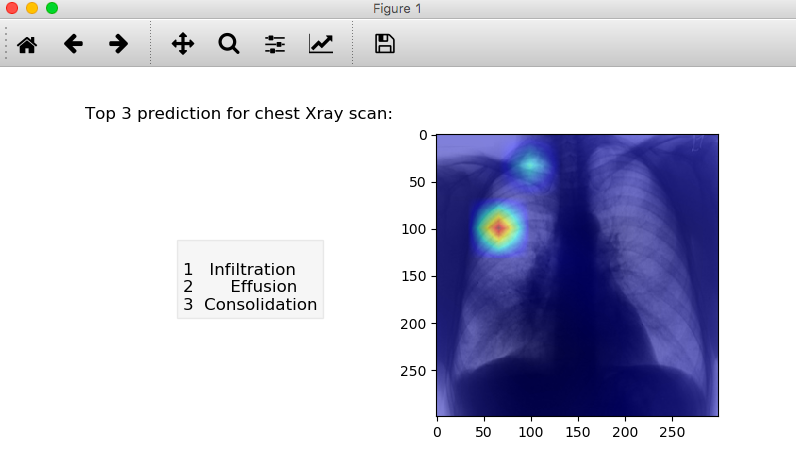

# Chest-X-Ray
Classifying the chest x-ray with Keras into 14 illness of:
- Hernia 
- Pneumonia
- Fibrosis
- Edema
- Emphysema
- Cardiomegaly
- Pleural_Thickening
- Consolidation
- Pneumothorax
- Mass
- Nodule
- Atelectasis
- Effusion
- Infiltration

# End result:

The accuracy of model is 94%.
